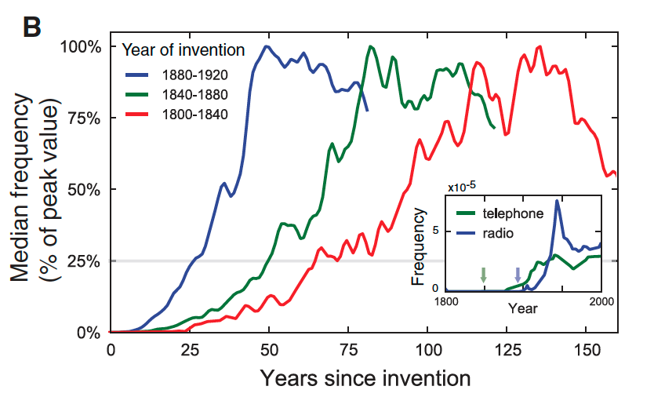
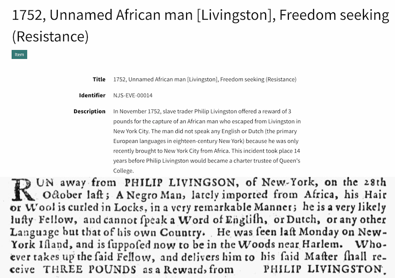

```{r setup, include=FALSE}

if (!(require(ggmap))) {
  install.packages("ggmap", repos = "http://cran.us.r-project.org")
}
if (!(require(leaflet))) {
  install.packages("leaflet", repos = "http://cran.us.r-project.org")
}
knitr::opts_chunk$set(echo = TRUE)
```

## Abstract
	
Is there a humanist way of working with data (cf. Posner, "Data Trouble")? This workshop prods at that question, examining tensions with quantification and categorization, and moving towards (we hope) repair and remediation. A hands-on portion will look at concrete ways to represent research topics as tabular data (aka a spreadsheet), one of the handiest and most portable of data formats. 

## Introduction

This workshop introduces the challenges and benefits of translating humanities sources into machine-accessible formats. It also provides a gentle introduction to programming in R using the RStudio environment.

Take a look around: you're in RStudio, an environment that makes coding in R more transparent. Your window is divided into four segments. In the upper right, you'll see the environment: this displays all the objects you have loaded into memory (currently none). In the upper left, you'll see the script editor: this is the place to work on code that you're currently writing (or borrowing from elsewhere!). To run code in code chunks (the grey chunks), you can either press Ctrl+Enter to run single lines or click the green arrow to run the entire chunk. In the lower left, you'll see the console: this is where code actually executes and where the output prints. In the lower right, you'll see a few different things. The "Files" tab shows whatever files live in the directory (or folder) that R is currently working in; if you run any plots, they'll show up in the "Plots" tab; you can also get help in the "Help" tab.

To start, if you're using your own computer, run the section of setup code above by clicking the green arrow in the upper right of the grey box.

## Humanities Data Tensions

In her talk, "Data Trouble," Miriam Posner enumerates some of the reasons behind the data negativity in some humanities circles. It goes beyond a fondness for close reading and an aversion to positivism. Those reasons fall under the sign of categorization. E.g.:

1. demarcation
2. parameterization
3. ontological stability
4. replicability
5. boundedness
6. deracination

As an example of the first, Posner discusses the culturomics authors' paper, specifically the visualization on inventions and their adoption rate.

{ width=70% }

### Demarcation

**Demarcation**: the separation of research observations into discrete items in order to perform operations on them.

In the figure above, the authors see proof that more recent cohorts of inventions were adopted more rapidly than previous cohorts. The visualization suggests that each invention cohort appeared like a bolt out of the blue. Humanists, on the other hand, tend to see inventions emerging from constellations of forces, integrating previous technologies in the succeeding technology. Not separate, in other words. And yet, separation is a necessary precondition for data manipulation and analysis. The computer can't do much with an undifferentiated mass of information. 

### Parameterization

**Parameterization**: a standard scale of measurement to facilitate comparisons.

Some things lend themselves well to parameterization: word counts, canvas size, the length of a song, or the shape of a pot. But within cultural artifacts, many features that are legible to human perception are difficult to parameterize, e.g. tone of voice, posture, facial expression. And some things that seem simple to measure, e.g. how far it is from London to Edinburgh, change considerably depending on the historical period, mode of transport, class status, gender, weather, and so on. 

### Ontological Stability

**Ontological stability**: how we organize entities to make a data model.

Ontologies get at the way in which one sees the world. To humanists, perspective changes things, occasionally in significant ways. Take for example this runaway slave advertisement from 1752 and its current (2022) representation in the [New Jersey Slavery Records](https://njslavery.org). 



### Replicability

**Replicability**: the benefit of published data is reuse and replicability, but *cui bono* in the humanities?

As Posner suggests, the interpretation of the data IS the work in the humanities, and it would be foreign to most humanists to suggest that any other scholar reach the same conclusions as they do. With that said, publishing well-structured and well described humanities datasets *does* facilitate building on previous data-centric work. That does count for a lot.

### Boundedness

**Boundedness**: all historical records are partial, therefore no historical dataset is representative?

We have a fairly limited vocabulary for referencing gaps or absences in our data, but there are some strategies.

### Deracination

**Deracination**: creating data involves capturing some aspects of our sources and disregarding others. In other words, some context is inevitably lost.

It's not possible to represent every feature of a given source. But fortunately, that is okay. No humanist would assert that a digitized book is the same as the print book used as its source. They both accomplish different purposes, and have different affordances and drawbacks.

To take another example, from the [correspondence edition of the War Service Bureau Records](https://rutgersdh.github.io/warservicebureau/), the following figure shows the editorial pipeline from manuscript letter, to TEI XML encoding of the same letter, to its HTML representation on the website. The web edition makes no effort to capture many of the material aspects of the source. It focuses on content and editorial annotation instead, on the assumption that readers can always refer back to the digitized or print manuscript. 


## Data Modeling

A few words on data modeling in the humanities... or in any discipline, really. 

This is a translation of Herbert Stachowiak's _Allgemeine Modelltheorie_ (General Model Theory) published in 1973, and borrowed from [modelpractice](https://modelpractice.wordpress.com/2012/07/04/model-stachowiak/). 

### Fundamental Model Properties

1. **Mapping**: Models are always models of something, i.e. mappings from, representations of natural or artificial originals, that can be models themselves.
2. **Reduction**: Models in general capture not all attributes of the original represented by them, but rather only those seeming relevant to their model creators and/or model users.
3. **Pragmatism**: Models are not uniquely assigned to their originals per se. They fulfill their replacement function a) for particular – cognitive and/or acting, model using subjects, b) within particular time intervals and c) restricted to particular mental or actual operations.

In other words, a lot of the tensions identified by Posner are good and normal insofar as we're aware of our individual contexts as researchers, and we document what we're trying to represent, and what we've determined to be out of scope. 

## Data from Archival Sources

Some archival sources can be readily understood as data. Take, for example, this antebellum American newspaper's subscription book. This is already a technology for organizing and storing data; we simply want to transcribe it so that we can represent and analyze it more effectively. Depending on one's research, one may want to quantify subscribers by gender, map their locations, or calculate turnover.

{ width=70% }

One of the simplest formats for representing multidimensional data is a spreadsheet, whether in Microsoft Excel, Google Sheets, or whichever other program you prefer. In R, data in this format is called a *data frame*.

```{r}
names <- c("Jacob Robinson", "Stephen Fuller", "William Taylor", "Ebenezer Seales", "Ebenezer Seales", "E Emerson", "Charles Buck", "J Sargent", "Age", "Hamilton Cate")
genders <- c("M", "M", "M", "M", "M", "M", "M", "M", "NA", "M")
towns <- c("South Andover", "West Lebanon", "West Lebanon", "West Lebanon", "West Lebanon", "Rochute", "North Littleton", "Wentworth", "Woodstock", "Woodstock")
states <- c("MA", "NH", "NH", "NH", "NH", "VT", "NH", "NH", "VT", "VT")
data.frame(Name=names, Gender=genders, Town=towns, State=states)
```

The basic principle of organizing data into this format is that it is highly structured. In order to take full advantage of this capacity, three conditions should be met:

- Each variable must have its own column
- Each observation must have its own row
- Each value must have its own cell

Getting data into this format will ensure that any future quantitative analysis moves smoothly. It's most efficient to do so from the very start.

It's possible that you may need to combine variables, or columns, later, but with computation it's very easy to combine variables, as with the `paste`. `paste` wants three inputs: the two objects being pasted together and the method (in this case, separating with a comma and a space).
```{r}
paste(towns, states, sep=", ")
```

Spreadsheet editors tend to have easy merging commands as well. In Google Sheets, for example, it's `=textjoin(", ", 1, K1, J1)` (replacing "K1" and "J1" with whichever cells are to be merged).

It's still possible to separate out one variable into two, but irregularities in your data can cause errors more readily. Here is a line of code that separates out first names, but if I had included periods after first initials ("J." instead of "J") it would require a bit more tweaking.
```{r}
gsub("(^\\w+) \\w+$", "\\1", names)
```

When inheriting spreadsheets from someone or somewhere else, these are two of the most common operations necessary for cleaning before analysis can begin. But there are more powerful functions that can be carried out in an instant in a programming language like R that are much trickier otherwise. Transposing a spreadsheet, flipping the rows and columns, just requires one `t()` function (for transpose); separating out alternating values in one column and spread across two columns can be done with `pivot_wider()`.

But there's other data in our archival document too. For example, some entries aren't individual subscribers: they're other newspapers. When transcribing, we tend to focus on the features in which we are interested for our specific research purpose. But sometimes we transcribe something even when we don't know if we'll need it later. In this case, we've decided to do something with those newspaper titles. We will convert them into categorical variables to track their presence or absence. 
```{r}
paper <- c(0, 0, 0, 0, 0, 0, 0, 0, 1, 0)
data.frame(Name=names, Gender=genders, Town=towns, State=states, Paper=paper)
```

There might be further implicit or noncharacter information contained in archival materials. This might include marginalia in printed documents or physical characteristics of materials. Some names are crossed out here; while it's impossible to know when they were crossed out, we know that their subscriptions ended before the life of this ledger did. This gives us a snapshot of a single moment of the data, which otherwise spans a couple years, and could help us better understand the whole.
```{r}
cancel <- c(1, 1, 0, 1, 1, 1, 1, 1, 0, 1)
ledger <- data.frame(Name=names, Gender=genders, Town=towns, State=states,
                     Paper=paper, Cancel=cancel)
ledger
```

Data frames can be indexed by individual cell, with a comma (`,`):
```{r}
ledger[1,1]
```

By row:
```{r}
ledger[1,]
```

Or by column, with a dollar sign (`$`):
```{r}
ledger$Name
```

But the real beauty of indexing is that we don't need to know the positions already. We can index the result of another function. The `which` function tells us which elements of a vector meet a particular condition.
```{r}
which(ledger$Cancel < 1)
```

Indexing these positions back into the ledger data frame as rows will give us the corresponding values.
```{r}
ledger[which(ledger$Cancel < 1),]
```

By calculating the `length` of our results - the number of elements in the vector produced by a function like `which` - we can do some basic arithmetic. What proportion of entries in the ledger were active subscribers upon its retirement?
```{r}
length(which(ledger$Cancel < 1)) / length(which(ledger$Cancel==1))
```

This is just the beginning, but it's enough to understand the basic principles at play here and, hopefully, their utility.

A note about file formats: a software agnostic, size-efficient format for spreadsheet data is a .csv file. This isn't the default for programs like Excel, but you can still open, edit, and save .csv files in Excel or Sheets, and if you start in one of those programs before shifting over to a programming language like R you'll need to save your spreadsheet as a .csv first (an option in the "Save as" menu). Writing to drive and reading from drive are each a simple function.
```{r, eval=FALSE}
write.csv(ledger, "ledger.csv")

ledger <- read.csv("ledger.csv")
```

## Exercises

*Exercise #1: NJ recommendations*

Let's take a few minutes as a group to add our personal recommendations of places to visit in New Jersey. These can be restaurants, places of historical interest, hiking trails, bodies of water, museums, boutiques, etc., well-known or otherwise. Go to <https://docs.google.com/spreadsheets/d/1P8xWaqCpGYJJj5cRCvPRTA9HQKEjrBnWBKRSunmWLlA/edit?usp=sharing> and add yours. Notice that I've made some assumptions about the useful categories for our data.

Next, we'll load our data into R in order to visualize it as a map. An important intermediate step to visualization is geocoding, or adding latitude and longitude coordinates to our `street address` column.  

```{r njrecs, include=FALSE, eval=FALSE}

# assign the URL to our Google sheet to a variable
google_sheet_csv <- 'https://docs.google.com/spreadsheets/d/e/2PACX-1vTglbQwJls-8Wis1cpTX829gjY7qTAKOLU3o0KoLNyOahX8zfj3kkEecEkRNYknP_96i-Ktp-XrZQN2/pub?gid=0&single=true&output=csv'

# create a dataframe with the contents of the sheet
nj_recommendations <- read_csv(google_sheet_csv, col_types='ffcfccccfc', skip = 1) 

# load libraries
library(ggmap)
library(leaflet)

# geocode data
# we need a Google Maps API key to geocode
register_google(key = " ", write = TRUE)
njrecs_geocoded <- geocode(nj_recommendations$city, output = "latlona", source = "google")

# do a little bit of fiddling to add the latlon pairs to our original dataframe
njrecs_merged <- merge(nj_recommendations, njrecs_geocoded, by.x = 0, by.y = 0)

```

I'm making an assumption that a map will help us to browse/query our data. Here, we place markers on a map and add popups with some data from our Google sheet. 

*Questions:*

1. In what way is a map useful, or not? What is lost and gained with this representation of our data? 
2. Can you imagine alternative ways of visualizing our data that would tell a different story or suggest another interpretation?

```{r map, include=FALSE, eval=FALSE}

# create popups with info about the locations
popup <- paste("From: ", 
               njrecs_merged$name, "of",
               njrecs_merged$residence, "<br>",
               "Place:",
               njrecs_merged$place, "<br>",
               "Description: ",
               njrecs_merged$description, "<br>",
               "Type: ",
               njrecs_merged$type)

# create a map!
leaflet(njrecs_merged) |>
  addProviderTiles('Stadia.OSMBright') |>
  addCircleMarkers(lng = ~lon, lat = ~lat, radius = 5, stroke = TRUE, color = '#d500cb',
                   popup = popup)

```

*Exercise #2: Creating a data model*

What kind of data model could a scholar working with historical maps of New Brunswick, NJ, create for their research project? What categories would this person need? Essential ones? Useful ones? Some [maps to consider in RUcore](https://rucore.libraries.rutgers.edu/search/results/?key=root&q1=%22New+Brunswick%22&q1field=mods%3AtitleInfo&q1bool=AND&q2=maps&q2field=mods%3Agenre&rtype%5B%5D=&orderby=dateasc&numresults=10&c%5B0%5D=rucore00000002054&c%5B1%5D=rucore00000002444&c%5B2%5D=Roosevelt&c%5B3%5D=rucore00000002267&c%5B4%5D=rucore00000002350&c%5B5%5D=rucore00000002142&c%5B6%5D=rucore00000002143&c%5B7%5D=rucore00000002177&c%5B8%5D=rucore00000002402&c%5B9%5D=rucore00000002337&c%5B10%5D=rucore00000002220&c%5B11%5D=rucore00000002394&c%5B12%5D=rucore00000002395&c%5B13%5D=rucore00000002244&c%5B14%5D=rucore00000002245&c%5B15%5D=SPCOLMAPS&c%5B16%5D=rucore00000002253&c%5B17%5D=rucore00000002239&c%5B18%5D=rucore00000002404&c%5B19%5D=rucore00000002436&c%5B20%5D=rucore00000002048&c%5B21%5D=rucore00000002172&c%5B22%5D=rucore00000002022&c%5B23%5D=RULGriffis&c%5B24%5D=rucore00000002432&c%5B25%5D=rucore00000002221&c%5B26%5D=rucore00000002352&c%5B27%5D=rucore00000002377&c%5B28%5D=RULIJS&c%5B29%5D=rucore00000002442&c%5B30%5D=rucore00000002421&c%5B31%5D=RULIJSJOHP&c%5B32%5D=rucore00000002112&c%5B33%5D=rucore00000002166&c%5B34%5D=rucore00000002429&c%5B35%5D=rucore00000002206&c%5B36%5D=rucore00000002380&c%5B37%5D=rucore00000002109) (click link). 

## Sources

Drucker, Johanna. 2021. _The Digital Humanities Coursebook: An Introduction to Digital Methods for Research and Scholarship_. Milton, UK: Taylor & Francis.

Flanders, Julia, and Fotis Jannidis. 2019. _The Shape of Data in the Digital Humanities: Modeling Texts and Text-Based Resources_. Abingdon, UK: Routledge.

Leslie, Alex. 2020. "What can be data in the humanities?" <https://github.com/azleslie/DatainHumanities>.

Michel, Jean-Baptiste, Yuan Kui Shen, Aviva Presser Aiden, Adrian Veres, Matthew K. Gray, Joseph P. Pickett, Dale Hoiberg, et al. 2011. “Quantitative Analysis of Culture Using Millions of Digitized Books.” _Science_ (American Association for the Advancement of Science) 331 (6014): 176–82. <https://doi.org/10.1126/science.1199644>.

Posner, Miriam. 2022. "Data Trouble." Open Data: Reuse, Redistribution, and Risk, American Philosophical Society, Philadelphia, PA. <https://www.youtube.com/watch?v=ggGXKSK-UP8>.
